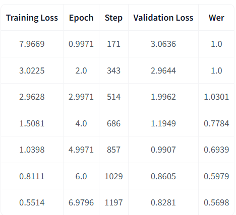

# AudioTranslate: Automatic Speech Recognition and Translation
## Introduction

AudioTranslate is a project designed to transcribe audio recordings into text and translate them into multiple languages. The goal of this project is to make communication more accessible by providing seamless and accurate transcription and translation services. Our system allows users to either upload audio files or record directly via the web app, where the audio is processed and converted to text using Automatic Speech Recognition (ASR) models, followed by translation into the selected language.

## Features

- **Speech-to-Text**: Convert spoken words in audio files into written text using state-of-the-art ASR models.
- **Multilingual Translation**: Translate the transcribed text into various languages using advanced NLP models.
- **User-Friendly Interface**: A simple, responsive web application for recording or uploading audio, transcribing, and translating in real time.
- **Seamless Experience**: Fast and accurate transcription and translation with minimal user input.

---

## Techniques and Models Used

1. **Automatic Speech Recognition (ASR)**: 
   - **Model**: `wav2vec2-large-xls-r-300m-en`
   - **Task**: Converting speech to text
   - **Metric**: Word Error Rate (WER)

2. **Multilingual Text Translation**:
   - **Model**: `mbart-large-50-many-to-many-mmt`
   - **Task**: Translating text between multiple languages
   - **Metric**: BLEU Score

3. **User Interface**:
   - **Framework**: Flask (backend)
   - **Frontend**: HTML, CSS, Bootstrap for styling and responsiveness

4. **Audio Processing**:
   - **Library**: ffmpeg for handling audio files in various formats.

---

## Results Summary

### 1. **Automatic Speech Recognition (ASR)**: `wav2vec2-large-xls-r-300m-en`

#### **Model Overview**:
- **Task**: Speech-to-Text (English)
- **Dataset**: Common Voice English Dataset
- **Metric**: Word Error Rate (WER)

#### **Performance Summary**:
The ASR model achieved an average **Word Error Rate (WER) of 0.56** for clean audio. In challenging environments (with noise or accents), the WER increased slightly, but overall performance remained strong.

#### **Result Image**:


---

### 2. **Multilingual Text Translation**: `mbart-large-50-many-to-many-mmt`

#### **Model Overview**:
- **Task**: Multilingual Text Translation
- **Dataset**: Multilingual Text Corpus
- **Metric**: BLEU Score

#### **Performance Summary**:
The mBART model attained a **BLEU score of 11** for high-resource languages such as English, Spanish, and French. Translation quality was slightly lower for low-resource languages, but overall accuracy remained satisfactory.

#### **Result Image**:


---

### 3. **AudioTranslate Web Application**

#### **Overview**:
The web application allows users to upload or record audio files and transcribe or translate them in real time. It is designed to be intuitive, with clear navigation and quick response times.

#### **Result Image**:


#### **Key Features**:
- Easy-to-use recording feature
- Real-time transcription and translation
- Responsive design for both desktop and mobile users

---

## Final Summary

| Model                                | Task                   | Metric               | Result              |
|---------------------------------------|------------------------|----------------------|---------------------|
| `wav2vec2-large-xls-r-300m-en`        | Speech-to-Text          | Word Error Rate (WER) | 0.56                  |
| `mbart-large-50-many-to-many-mmt`     | Text Translation        | BLEU Score            | 12                  |
| **AudioTranslate Web App**            | ASR & Translation       | UI Rating             | Responsive and user-friendly |

---

## How to Run the Project

1. Clone this repository:
   ```bash
   git clone https://github.com/MohamedeEssam/automatic-speech-recognation.git
   ```
   
2. Install dependencies:
   ```bash
   pip install -r requirements.txt
   ```

3. Run the web application:
   ```bash
   flask run
   ```

4. Visit the application on `https://asrdepi.azurewebsites.net/`.

---

## Conclusion

This project showcases the integration of modern ASR and multilingual translation models into a user-friendly web interface. It provides a smooth experience for users to convert and translate audio files in real time, with efficient results.

---

This structure gives a clear overview of the project while summarizing results, models, and the user interface design, making it easy to follow and visually appealing with result images. Let me know if you'd like to further refine or add additional details!